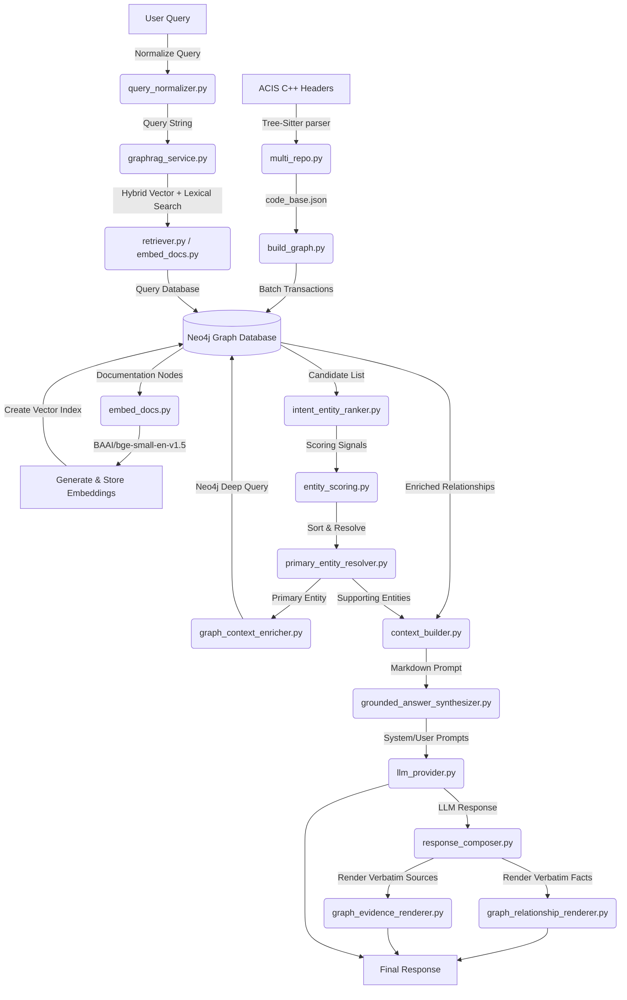

# ACIS GraphRAG System: Architecture & Code Documentation Report

## 1. Executive Summary
The ACIS GraphRAG (Retrieval-Augmented Generation) system is an enterprise-grade repository explorer and developer assistant. It extracts, embeds, indexes, and queries C++ API declarations from the ACIS include files. 

By integrating a **macro-resilient Tree-Sitter parser**, a **Neo4j property graph**, a **SentenceTransformers vector space**, and an **intent-driven RAG pipeline**, the system provides high-fidelity, grounded explanations of class hierarchies, method interfaces, enums, and geometric operations. The system isolates semantic summaries generated by LLMs from raw, database-verifiable facts (relationships and source listings), guaranteeing auditability and eliminating hallucinations.

---

## 2. System Architecture & Data Flow
The following diagram illustrates the multi-stage query execution and data pipeline:



---

## 3. Directory Layout
Following a clean productionization structure, the codebase is laid out as follows:
*   `src/`: Contains all core production Python code.
    *   `multi_repo.py`: The C++ source-code parsing pipeline.
    *   `build_graph.py`: Knowledge Graph schema builder and data loader.
    *   `embed_docs.py`: SentenceTransformer semantic vector generator and search retriever.
    *   `retriever.py`: High-performance query retrieval layer.
    *   `query_normalizer.py`: Sanitizes and matches shorthand queries.
    *   `intent_entity_ranker.py`: Detects search intent and applies base rankings.
    *   `entity_scoring.py`: In-memory entity evaluation heuristics.
    *   `primary_entity_resolver.py`: Isolates the core symbol from secondary evidence.
    *   `graph_context_enricher.py`: Performs database context lookups for the primary match.
    *   `context_builder.py`: Organizes data payloads for prompt inclusion.
    *   `llm_provider.py`: Unified API client wrapper supporting multiple LLM backends.
    *   `grounded_answer_synthesizer.py`: Formulates structured prompting bounds.
    *   `graph_relationship_renderer.py`: Generates Markdown representation of Neo4j relations.
    *   `graph_evidence_renderer.py`: Generates Markdown list of source nodes.
    *   `response_composer.py`: Assembles the final, multi-part response layout.
    *   `api_models.py` / `api_server.py`: FastAPI endpoints, Pydantic schemas, and server setup.
*   `data/` & `code_base.json`: Intermediate structured JSON representations.
*   `tests/`: Verification scripts and validation cases.
*   `logs/`: Service and database load logs.

---

## 4. Detailed Component & Code Documentation

### 4.1 Parser & Extraction Layer (`multi_repo.py`)
*   **Purpose**: Programmatic C++ parsing that extracts class properties and relationships, completely bypassing macro-corruptions.
*   **Key Functions**:
    *   `parse_file(file_path)`: Uses `tree-sitter-cpp` to walk the file AST. It captures:
        *   Classes, Structs, Enums (including EnumValues), Typedefs, Namespaces, and `#include` declarations.
        *   Functions and Class Methods (including access specifiers, parameters, return types, constness, and virtual qualifiers).
    *   `clean_comment(comment_text)`: Regex parser that strips HTML formatting, discards copyright boilerplate, and formats docstrings (e.g., preservation of `@param`, `Role:`, `Effect:` sections).
    *   `is_legitimate_name(...)`: Filter out noise, compiler macros, or corrupted identifiers.

### 4.2 Ingestion & Knowledge Graph Construction (`build_graph.py`)
*   **Purpose**: Ingests parsed structural elements into the Neo4j Graph Database.
*   **Key Design Elements**:
    *   `normalize_class_name(name)` / `normalize_parameter_type(type_str)`: Strips template brackets (e.g., `<double>`), pointers (`*`), references (`&`), namespaces, and macros for unified entity matching.
    *   `reset_database()` / `create_constraints()`: Detaches old graphs and sets unique node constraints to enforce relational integrity.
    *   `build_graph(data)`: Large-scale transactional batching ($500$ records per transaction) to write nodes and relationships, tracking ingestion statistics and reporting failures. Uses SHA-256 hashes of class scopes/signatures to prevent naming collisions.

### 4.3 Semantic Indexing & Vector Retrievers (`embed_docs.py` & `retriever.py`)
*   **Purpose**: Performs vectorization of documentation strings and supports fast hybrid candidate retrieval.
*   **Key Components**:
    *   `SemanticRetriever`: Encapsulates model interactions (`SentenceTransformer` using model `BAAI/bge-small-en-v1.5`).
    *   `generate_and_store_embeddings()`: Encodes documentation text block by block, updating the `embedding` field of corresponding Neo4j `Documentation` nodes.
    *   `create_vector_index()`: Configures a Neo4j cosine similarity Vector index (`documentation_embedding_index`) with $384$ vector dimensions.
    *   `semantic_search(query, top_k)`: Executes a hybrid search combining vector retrieval, case-insensitive exact lookup, and tokenized lexical matches on entity names.

### 4.4 Intent Detection & Scoring (`intent_entity_ranker.py` & `entity_scoring.py`)
*   **Purpose**: Analyzes the query to identify developer intent and score candidates in-memory.
*   **Key Functions**:
    *   `detect_intent(query)`: Categorizes queries into `Definition` (what is), `Functional Explanation` (how to/workflows), `Relationship` (which/inherit), or `Navigation` (where is).
    *   `score_entity(query, item)`: Evaluates candidate nodes without new database calls:
        $$\text{Score} = f(\text{Lexical Match}) + f(\text{Type Priority}) + f(\text{Doc Length}) + f(\text{Context Connectivity})$$
        *   *Lexical Match*: High priority for exact term matches.
        *   *Type Priority*: Definition queries favor `Class`/`Struct`; workflow queries favor `Function`/`Method`.
        *   *Context Connectivity*: Approximates relationship density from surrounding context fields.

### 4.5 Primary Entity Resolution (`primary_entity_resolver.py` & `graph_context_enricher.py`)
*   **Purpose**: Isolates the main subject of inquiry and dynamically expands its surrounding graph.
*   **Key Functions**:
    *   `resolve_primary_entity(query, retrieved_entities)`: Segregates entities, assigning the top-scoring candidate as the `Primary Entity` and the remainder as `Supporting Entities`.
    *   `enrich_context(results)`: Traverses Neo4j for the single primary entity to fetch inheritance paths, method lists, parameters, return types, and enum values.

### 4.6 Context Generation & Grounding (`context_builder.py` & `grounded_answer_synthesizer.py`)
*   **Purpose**: Assembles Markdown contexts and builds grounded prompt wrappers.
*   **Key Functions**:
    *   `build_context(enriched_primary, supporting_entities)`: Collates the primary entity description and lists supporting elements in a clean Markdown context block.
    *   `build_synthesis_prompt(query, context)`: Enforces strict LLM directives: explain only *what it is, why it is used, and how it works*; omit structured listings or relationships; mandate exact fallback string if undocumented.

### 4.7 Presentation Layer (`response_composer.py`, `graph_relationship_renderer.py` & `graph_evidence_renderer.py`)
*   **Purpose**: Structures the final client output by separating synthesis from source facts.
*   **Key Components**:
    *   `render_relationships(primary_full)`: Generates structured Markdown trees of parents, methods, parameters, and returns.
    *   `render_evidence(sources, primary, primary_type)`: Lists files and symbols representing the exact retrieved sources.
    *   `compose_response(graphrag_output)`: Merges the LLM explanation sections with raw ASCII database relationships and evidence paths.

---

## 5. Knowledge Graph Schema Specification

The Neo4j database uses a highly optimized graph schema mapping the structure of the C++ codebase:

### 5.1 Node Definitions & Attributes
*   **`File`**: Represents a physical header/source file. Attributes: `path`, `file`.
*   **`Class` / `ExternalClass`**: C++ Class definitions. Attributes: `id`, `name`, `documentation`, `line_number`.
*   **`Struct`**: C++ Structs. Attributes: `id`, `name`, `documentation`, `line_number`, `file_path`.
*   **`Enum`**: Enumeration types. Attributes: `id`, `name`, `documentation`, `line_number`, `file_path`.
*   **`EnumValue`**: Enumerator instances. Attributes: `id`, `name`, `value`, `position`.
*   **`Typedef`**: Typename alias mappings. Attributes: `id`, `name`, `target_type`, `documentation`, `line_number`, `file_path`.
*   **`Function` / `Method`**: Executable items. Attributes: `id`, `name`, `signature`, `return_type`, `documentation`, `line_number`.
*   **`Parameter`**: Input argument representations. Attributes: `id`, `name`, `type`, `position`, `default_value`, `is_const`, `is_pointer`, `is_reference`.
*   **`PrimitiveType` / `ExternalType`**: Data types. Attributes: `name`.
*   **`Documentation`**: Semantic textual node. Attributes: `id`, `text`, `length`, `entity_type`, `entity_name`, `file_path`, `embedding` (vector array).

### 5.2 Edge Definitions (Relationships)
*   `(:File)-[:CONTAINS]->(:Class | :Function | :Enum | :Struct | :Typedef)`
*   `(:Class)-[:INHERITS]->(:Class | :ExternalClass)`
*   `(:Class)-[:HAS_METHOD]->(:Method)`
*   `(:Function | :Method)-[:HAS_PARAMETER]->(:Parameter)`
*   `(:Function | :Method)-[:RETURNS]->(:Class | :PrimitiveType | :ExternalType)`
*   `(:Parameter)-[:USES_TYPE]->(:Class)`
*   `(:Enum)-[:HAS_VALUE]->(:EnumValue)`
*   `(:Class | :Struct | :Enum | :Function | :Method)-[:HAS_DOC]->(:Documentation)`

---

## 6. API Service Contract

The FastAPI server exposes endpoints for health auditing and semantic pipeline queries.

### 6.1 Endpoints
*   **`GET /health`**
    *   *Purpose*: Performs connection sanity testing on the Neo4j driver and logs status metrics.
    *   *Response Example*:
        ```json
        {
          "status": "healthy",
          "neo4j": "connected",
          "retriever": "ready",
          "llm": "ready",
          "repository": "ACIS",
          "version": "1.1"
        }
        ```
*   **`POST /query`**
    *   *Purpose*: Executes the GraphRAG service query pipeline. Enforces a 15-second timeout limit.
    *   *Request Payload*:
        ```json
        {
          "repository": "ACIS",
          "query": "What is SPAposition?"
        }
        ```
    *   *Response Payload*:
        ```json
        {
          "query": "What is SPAposition?",
          "status": "success",
          "answer": "...",
          "formatted_answer": "...",
          "summary": "...",
          "sections": {
            "definition": "...",
            "purpose": "..."
          },
          "sources": [
            {
              "entity_type": "Class",
              "entity_name": "SPAposition",
              "repository": "ACIS",
              "score": null
            }
          ],
          "retrieval_time": 0.05,
          "generation_time": 1.25,
          "total_time": 1.30
        }
        ```
