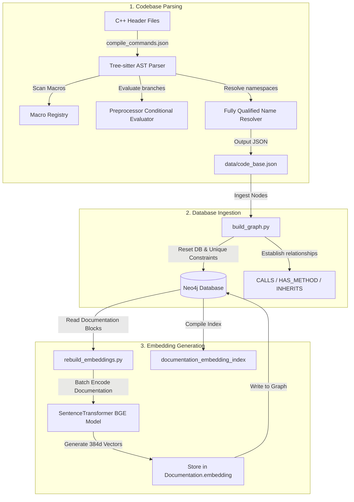
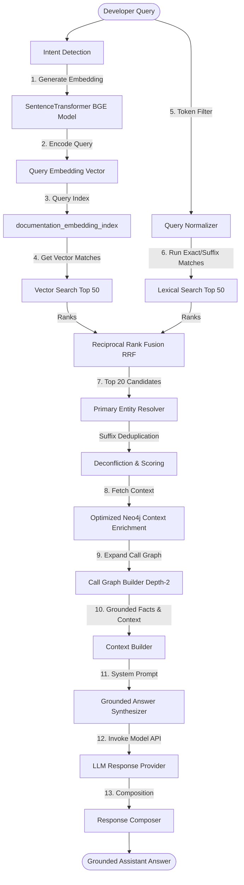

# Visual System Architecture & Dataflows

This document presents the visual dataflow and pipeline diagrams for the ACIS GraphRAG codebase, highlighting how semantic embeddings and call graphs coordinate during Ingestion and Retrieval.

---

## 🏗️ 1. Ingestion Dataflow Pipeline

The ingestion pipeline runs offline. It is responsible for parsing C++ codebase structures, mapping them to a Neo4j database schema, generating documentation embeddings, and building indexes.

---

## 🔍 2. Runtime Query & Retrieval Pipeline

The runtime pipeline is synchronous and executes when a developer sends a query. It extracts semantic and lexical candidates, fuses them, enriches their context, and generates a grounded response.

---

## 🧠 3. Query Trace Analysis

This trace example walks through the query: `"How does variable radius blending work?"`

### Step 1: Query Embedding
The query is encoded by the local BAAI/bge-small-en-v1.5 model, outputting:
`[0.0534, -0.0123, 0.0874, ..., 384 floats]`

### Step 2: Parallel Search Generation
- **Vector Stream**: The query vector is passed to the Neo4j vector search index. It identifies matching documentation texts. The top result is the documentation node for the method `api_blend_edges_pos_rad` (Cosine Similarity: `0.8971`).
- **Lexical Stream**: The query normalizer extracts the terms `['variable', 'radius', 'blending', 'work']`. It searches for symbols matching these strings.

### Step 3: Reciprocal Rank Fusion
- `api_blend_edges_pos_rad` is ranked **#1** in Vector Search and is absent in Lexical Search. RRF Score:
  $$RRF(\text{api\_blend\_edges\_pos\_rad}) = \frac{1}{60 + 1} + 0 \approx 0.01639$$
- `ATTRIB_VAR_BLEND` is ranked **#7** in Vector Search and **#5** in Lexical Search. RRF Score:
  $$RRF(\text{ATTRIB\_VAR\_BLEND}) = \frac{1}{60 + 7} + \frac{1}{60 + 5} \approx 0.01492 + 0.01538 \approx 0.03030$$
- Because of RRF, `ATTRIB_VAR_BLEND` rises to the **#1** spot overall because it is highly relevant across both semantic and exact identifier dimensions, despite not having the highest vector similarity score on its own.

### Step 4: Context Enrichment & Synthesis
- The Top 20 candidates (led by `ATTRIB_VAR_BLEND` and `api_blend_edges_pos_rad`) are sent to Neo4j.
- The optimized query seeks their FQNs and returns parameters, inheritance, and call paths.
- The context builder formats these facts, and the synthesizer issues a Gemini API call to draft a C++ developer response fully grounded in the retrieved code facts.
